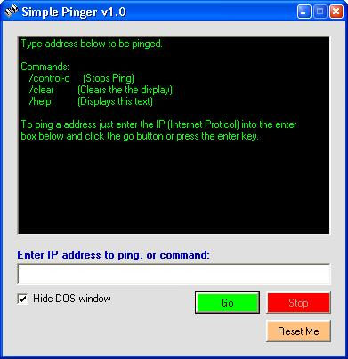



## Simple Pinger

### Description

This is a simple pinger program. It shows how to ping using DOS commands (ping.exe in windows). Shows how to use dos commands so you can use any DOS command in VB. Its just something i threw together for a friend so he can ping without going threw the dos prompt. Please vote for me. Thanks :)
 
### More Info
 

             |
---                |---
**Submitted On**   |2003-09-15 14:55:58
**By**             |[Ryan33](https://github.com/Planet-Source-Code/PSCIndex/blob/master/ByAuthor/ryan33.md)
**Level**          |Intermediate
**User Rating**    |5.0 (15 globes from 3 users)
**Compatibility**  |VB 6\.0
**Category**       |[Internet/ HTML](https://github.com/Planet-Source-Code/PSCIndex/blob/master/ByCategory/internet-html__1-34.md)
**World**          |[Visual Basic](https://github.com/Planet-Source-Code/PSCIndex/blob/master/ByWorld/visual-basic.md)
**Archive File**   |[Simple\_Pin1647899202003\.zip](https://github.com/Planet-Source-Code/ryan33-simple-pinger__1-48646/archive/master.zip)

